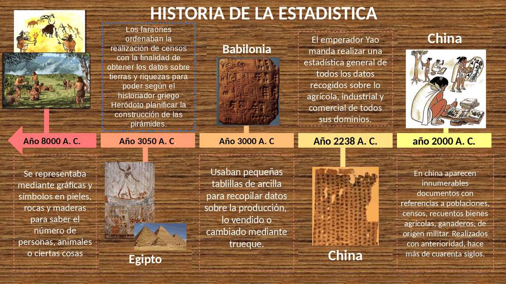

```{=html}
<div style="position: absolute; top: 10px; right: 10px;">
  
</div>
```

```{=html}
<style type="text/css">
  body {
    font-size: 130%;
    text-align: justify;
  }
</style>
```

# .Cargar paquetes

```{r}
ipak <- function(pkg){
  
  # Definir repositorio CRAN (evita el error del mirror)
  options(repos = c(CRAN = "https://cloud.r-project.org"))
  
  # Identificar paquetes instalados
  installed <- rownames(installed.packages())
  
  # Identificar paquetes faltantes
  new.pkg <- setdiff(pkg, installed)
  
  # Instalar paquetes faltantes
  if(length(new.pkg) > 0){
    install.packages(new.pkg, dependencies = TRUE)
  }
  
  # Cargar paquetes sin mostrar mensajes
  invisible(lapply(pkg, function(p){
    suppressPackageStartupMessages(
      library(p, character.only = TRUE)
    )
  }))
}

# Crear la lista de los paquetes a utilizar
packages <- c("tidyverse", "kableExtra", "psych", "readxl")

# Instalar y cargar los paquetes del listado anterior
ipak(packages)
```

# .Historia de la estadística nueva

La historia de la estadística es el resultado de la necesidad humana de **recopilar, organizar y analizar información** para la toma de decisiones, especialmente en contextos administrativos, económicos y científicos.

En sus orígenes, las primeras prácticas estadísticas se remontan a civilizaciones antiguas como Egipto, Babilonia y China, donde se realizaban censos poblacionales y registros agrícolas con fines tributarios y militares. Estas actividades no constituían aún una teoría estadística, pero sentaron las bases del manejo de datos.

Durante los siglos XVII y XVIII, la estadística comienza a adquirir un carácter más formal. En Inglaterra, John Graunt analizó registros de mortalidad, dando origen a la demografía. Posteriormente, William Petty introdujo la “aritmética política”, enfocada en el análisis cuantitativo del Estado.

El desarrollo de la teoría de la probabilidad en el siglo XVII, con figuras como Blaise Pascal y Pierre-Simon Laplace, fue crucial para el avance de la estadística, ya que permitió modelar la incertidumbre y fundamentar inferencias.

En el siglo XIX, la estadística se consolida como disciplina científica. Karl Pearson desarrolló conceptos clave como la correlación y el método de los momentos, mientras que Francis Galton introdujo ideas como la regresión hacia la media. Estos aportes fortalecieron el análisis de datos en ciencias naturales y sociales.

Finalmente, en el siglo XX, la estadística moderna se estructura con el trabajo de Ronald A. Fisher, quien estableció bases de la inferencia estadística, el diseño experimental y el análisis de varianza. A partir de entonces, la estadística se ha expandido a múltiples áreas, incluyendo la economía, la ingeniería, la medicina y, más recientemente, la ciencia de datos.

En síntesis, la estadística ha evolucionado desde simples registros administrativos hasta convertirse en una herramienta fundamental para la **toma de decisiones basada en evidencia y el análisis de fenómenos complejos**.

Claro, aquí tienes una **línea de tiempo de la historia de la estadística**, presentada de forma clara y sintética:

**Línea de tiempo de la Estadística**

**Antigüedad (3000 a.C. – 500 d.C.)**

-   Civilizaciones como Egipto, Babilonia y China realizan censos y registros agrícolas.
-   Uso de datos con fines administrativos, tributarios y militares.

**Siglo XVII (1600s)**

-   Nace la estadística moderna en Inglaterra.
-   John Graunt analiza datos de mortalidad.
-   William Petty desarrolla la “aritmética política”.
-   Desarrollo inicial de la probabilidad con Blaise Pascal.

**Siglo XVIII (1700s)**

-   Consolidación de la teoría de la probabilidad.
-   Aportes de Pierre-Simon Laplace al análisis probabilístico.
-   Se fortalece el uso de datos en astronomía y ciencias naturales.

**Siglo XIX (1800s)**

-   Formalización de la estadística como disciplina científica.
-   Adolphe Quetelet aplica la estadística a fenómenos sociales.
-   Francis Galton introduce la regresión y correlación.
-   Karl Pearson desarrolla métodos estadísticos fundamentales.

**Siglo XX (1900s)**

-   Desarrollo de la inferencia estadística moderna.
-   Ronald A. Fisher impulsa el diseño experimental y ANOVA.
-   Avances en pruebas de hipótesis y estimación.

**Siglo XXI (2000s – actualidad)**

-   Expansión hacia la ciencia de datos, inteligencia artificial y big data.
-   Uso intensivo de software estadístico (R, Python).
-   Aplicaciones en economía, salud, educación y tecnología.

{fig-align="center"}

Como estadístico analista de datos, te explico de forma clara y aplicada el concepto de **variables en estadística**, su clasificación y su uso en **administración pública**:


# .Variables


**Concepto de variable estadística**

Una **variable estadística** es una característica o atributo que se observa o mide en los individuos de una población y que **puede tomar diferentes valores**.

Ejemplo en administración pública:

* Número de beneficiarios de un programa social
* Nivel educativo de funcionarios
* Tiempo de atención en una entidad pública


**Clasificación de las variables según su naturaleza**

a) Variables cualitativas (categóricas)

Describen cualidades o atributos. No se expresan numéricamente (aunque pueden codificarse).

**Tipos:**

* **Nominales** (sin orden):

  * Ejemplo:

    * Tipo de contrato (planta, provisional, contratista)
    * Régimen de salud (contributivo, subsidiado)

* **Ordinales** (con orden):

  * Ejemplo:

    * Nivel de satisfacción del ciudadano (bajo, medio, alto)
    * Clasificación del desempeño laboral (deficiente, aceptable, sobresaliente)


b) Variables cuantitativas (numéricas)

Se expresan con números y permiten operaciones matemáticas.

**Tipos:**

* **Discretas** (valores enteros):

  * Ejemplo:

    * Número de trámites realizados por día
    * Cantidad de funcionarios en una dependencia

* **Continuas** (valores en intervalos):

  * Ejemplo:

    * Tiempo de atención (en minutos)
    * Presupuesto ejecutado (en millones de pesos)


**Escalas de medición**

Las escalas determinan qué tipo de análisis estadístico es válido aplicar. Se fundamentan en principios de medición en Estadística.

a) Escala nominal

* Clasifica sin orden
* Solo permite contar frecuencias

**Ejemplo (sector público):**

* Tipo de entidad (nacional, departamental, municipal)


b) Escala ordinal

* Clasifica con orden, pero sin distancia exacta entre categorías

**Ejemplo:**

* Nivel de calidad del servicio (malo, regular, bueno, excelente)


c) Escala de intervalo

* Tiene orden y distancia entre valores
* No tiene cero absoluto

**Ejemplo:**

* Temperatura en oficinas públicas (°C)


d) Escala de razón

* Tiene orden, distancia y cero absoluto
* Permite todas las operaciones matemáticas

**Ejemplo:**

* Ingresos fiscales
* Número de usuarios atendidos
* Tiempo de respuesta en días


**Ejemplo integrador (Administración pública)**

| Variable              | Tipo         | Naturaleza | Escala    |
| --------------------- | ------------ | ---------- | --------- |
| Tipo de contrato      | Cualitativa  | Nominal    | Nominal   |
| Nivel de satisfacción | Cualitativa  | Ordinal    | Ordinal   |
| Número de trámites    | Cuantitativa | Discreta   | Razón     |
| Tiempo de atención    | Cuantitativa | Continua   | Razón     |
| Temperatura oficina   | Cuantitativa | Continua   | Intervalo |

<br>


$$f(x) = \operatorname{li}(x) - \sum_{p} \operatorname{li}(x^{p}) - \log(2) + \int_{x}^{\infty} \frac{dt}{t(t^{2} - 1)\log(t)}$$

